# Extra: setting up for Mechatronics

This guide assumes that you already followed the steps defined in [this document](WindowsSettings.md). In particular, MATLAB installation and configuration.

# Table of Contents
- [Extra: setting up for Mechatronics](#extra-setting-up-for-mechatronics)
- [Table of Contents](#table-of-contents)
- [Installing Software](#installing-software)
    - [Putty](#putty)
    - [HTerm](#hterm)
    - [STM32 CubeMX](#stm32-cubemx)
    - [STM32 System Workbench](#stm32-system-workbench)
- [Configuration](#configuration)
- [STM32F767ZI Nucleo PINs Cheatsheet](#stm32f767zi-nucleo-pins-cheatsheet)
- [Building a project using STM32 CubeMX](#building-a-project-using-stm32-cubemx)
    - [Project Settings](#project-settings)
        - [Stack Usage](#stack-usage)
    - [Assigning Purposes to PINs](#assigning-purposes-to-pins)
    - [GPIO Ports Configuration](#gpio-ports-configuration)
    - [Global Clock Configuration](#global-clock-configuration)
    - [USART Configuration](#usart-configuration)
    - [Reading/Writing GPIO PINs](#readingwriting-gpio-pins)
    - [~~Reading~~/Writing on USART using Blocking API](#readingwriting-on-usart-using-blocking-api)
    - [Interrupts and USART3 Interrupt API](#interrupts-and-usart3-interrupt-api)
    - [Timers](#timers)
        - [Configurable Timers Characteristics](#configurable-timers-characteristics)
            - [Advanced-Control Timers (TIM1, TIM8)](#advanced-control-timers-tim1-tim8)
            - [General-Purpose Timers (TIMx)](#general-purpose-timers-timx)
            - [Basic Timers (TIM6, TIM7)](#basic-timers-tim6-tim7)
        - [Timer Clock Sources](#timer-clock-sources)
        - [Timer Modes for each Channel](#timer-modes-for-each-channel)
            - [Timer Input Capture Mode](#timer-input-capture-mode)
            - [Timer Output Compare Mode](#timer-output-compare-mode)
            - [Timer PWM Mode](#timer-pwm-mode)
            - [Timer One Pulse Mode](#timer-one-pulse-mode)
    - [Configuring a Timer using Cube](#configuring-a-timer-using-cube)
        - [Timer Counter Settings](#timer-counter-settings)
            - [Example: Calculating the Required Values](#example-calculating-the-required-values)
        - [Timer Interrupt Generation Settings](#timer-interrupt-generation-settings)
            - [Example: Producing Periodic Data Using Interrupts](#example-producing-periodic-data-using-interrupts)
            - [Example: Sending Periodically Data to MATLAB](#example-sending-periodically-data-to-matlab)
            - [Example: Generating Code from Simulink](#example-generating-code-from-simulink)
        - [Timer Output Compare Settings (TODO)](#timer-output-compare-settings-todo)
        - [Timer PWM Mode Settings (TODO)](#timer-pwm-mode-settings-todo)
    - [Using DMA](#using-dma)
- [Mechatronics Exam Package Practical Guide](#mechatronics-exam-package-practical-guide)
    - [The Cube Project](#the-cube-project)
    - [The C Code](#the-c-code)

# Installing Software

Make sure to install following programs (each element is a link to where to get them):
- [PuTTY](https://www.chiark.greenend.org.uk/~sgtatham/putty/latest.html)
- [HTerm](http://www.der-hammer.info/terminal/hterm.zip)
- [STM32 CubeMX](https://www.st.com/en/development-tools/stm32cubemx.html#getsoftware-scroll)
- [STM32 System Workbench](http://www.openstm32.org/Downloading%2Bthe%2BSystem%2BWorkbench%2Bfor%2BSTM32%2Binstaller)

## Putty
Just install it.

## HTerm
- Extract `HTerm.exe` inside `"C:\Tools\"`
- Create a Desktop Shortcut
- Move the new shortcut to `"C:\Users\username\AppData\Roaming\Microsoft\Windows\Start Menu\Programs\Tools"`

## STM32 CubeMX
Extract the zip file and execute the Windows Installer, accept everything as-is.

## STM32 System Workbench

Execute the installer, change installation path with `C:\Program Files\Ac6\SystemWorkbench` (for 64-bit version, for 32-bit `C:\Program Files (x86)\Ac6\SystemWorkbench`), then accept everything else as-is.

> **NOTICE**: Installing System Workbench to a directory under `Program Files` (or its equivalent `Program Files (x86)`) leads to problems with permissions when using the program, since common users cannot write/modify content under subfolders of `Program Files`. Thus, either install it under another directory (example: `C:\Ac6\SystemWorkbench`) or change its permissions before opening the program.

# Configuration

**TODO**

# STM32F767ZI Nucleo PINs Cheatsheet

| User LEDs | Color | PIN          |
| --------- | ----- | ------------ |
| LED 1     | GREEN | PB0 (or PA5) |
| LED 2     | BLUE  | PB7          |
| LED 3     | RED   | PB14         |

| Service LEDs | Function             |
| ------------ | -------------------- |
| LED 4        | (TRIE color) ST-Link |
| LED 5        | USB Power Fault      |
| LED 6        | Power 5V             |
| LED 7/8      | USB OTG Status       |

| Button   | PIN           |
| -------- | ------------- |
| USER BTN | PC13 (or PA0) |
| RESET    | -             |

| Serial Ports | PIN |
| ------------ | --- |
| USART 3 TX   | PD8 |
| USART 3 RX   | PD9 |


# Building a project using STM32 CubeMX

This application uses the HAL libraries to generate code exactly for the stuff that we want to use, optimizing the overall code and letting us to concentrate only on the things that our controller will do, instead of what we need to configure via code to make this happen.

When first opening STM32 CubeMX (from now on simply Cube), click on `New Project`, then wait for the program to download all its stuff and then search for our target board, the `STM32F767ZI`. When you get the following screen, double-click it to create a new project.

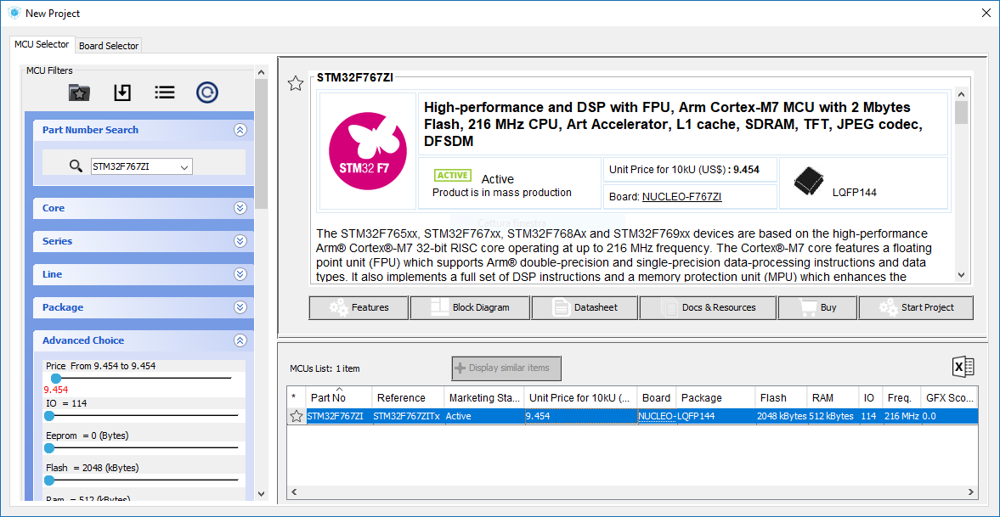

## Project Settings

From the `Project` menu on top, let’s change its `Settings`. From this window we can choose destination folder of the project and generated code and which IDE we will use to write our application code. We will use STM32 System Workbench as IDE, thus we need to select `SW4STM32` as `Toolchain/IDE`. If prompted to download firmware for the board accept.

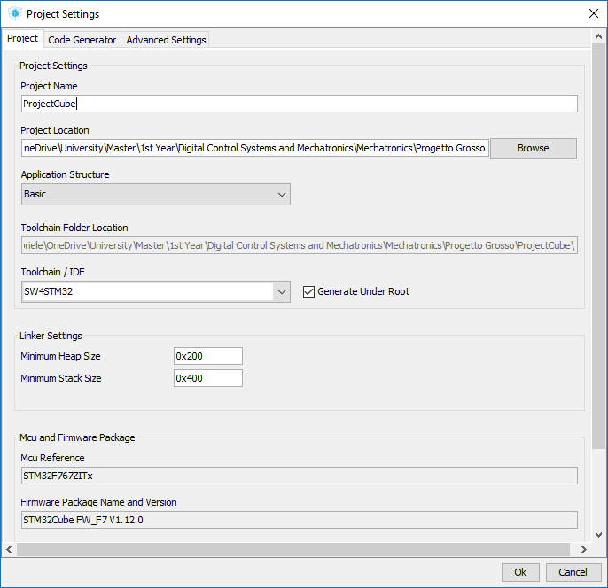

From the code generator tab we can customize some attributes about our project, like if we want that the libraries we use will be put as plain code in the project or simply linked in the makefile and so on. For now, we will leave all the standard settings in this tab.

Once settings are saved, we can use the configuration to generate code comprehending libraries and other configurations, depending on the other changes we made within this very project file. Once the code is generated, the `.project` file can be opened using STM32 System Workbench.


### Stack Usage
When programming a microcontroller, the size of the stack is really important. Since most of the code will be *interrupt-driven*, each call will consume stack to save the states of the registers to restore them later when the interrupt handler terminates.

The number of registers that will be saved may vary from call to call, but usually we have two cases:
- If the interrupt doesn't use any *floating-point arithmetic*, only 8 registers are pushed on the stack;
- Otherwise, 32 registers are pushed on the stack.

Since in general for multithreaded applications pretty much the whole code is interrupt-driven, we will consume a lot of stack for each call. This could lead to stack overlapping with the `.DATA` part of our program if we don’t select enough stack size in `Project Settings`.

Plus, we wouldn’t notice this problem until something very bad happens, like when we overwrite a global variable thinking to write in a local (stack) variable instead.


## Assigning Purposes to PINs
A PIN cannot be used if it is not set for a specific purpose (in/out, etc.). To assign a purpose to a PIN click on it and select the one that fits your requirements (consider looking at [these tables](#STM32F767ZI-Nucleo-PINs-Cheatsheet)).

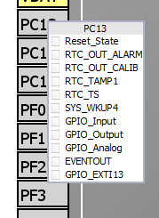

When a purpose is assigned you can even add a human-readable label to the PIN (one that can later be used within your code) if you right-click it and you select `Enter user label`.


Go on and set up all following PINs:
| PIN  | Mode          | User Label  |
| ---- | ------------- | ----------- |
| PB0  | `GPIO_Output` | `LED_GREEN` |
| PB7  | `GPIO_Output` | `LED_BLUE`  |
| PB14 | `GPIO_Output` | `LED_RED`   |
| PC13 | `GPIO_Input`  | `BTN_USR`   |

## GPIO Ports Configuration
To configure GPIO Ports, switch to `Configuration` tab and select the `GPIO` entry.

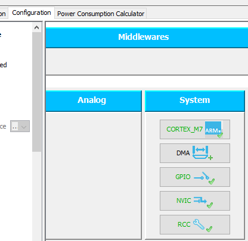

From this panel, we can customize all ports configuration, the pull-up/down modes and so on. We will select an `open-drain/pull-up` mode for the `PB0` port (`LED_GREEN`). All the other ports will remain unchanged.

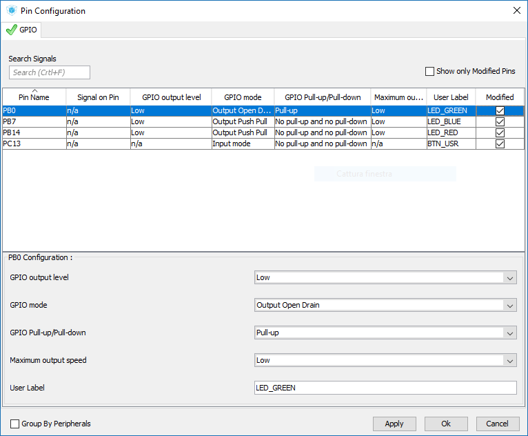


## Global Clock Configuration

Clock configuration can be achieved through different tools. The first one allows us to use *internal clock* as a base for our desired clock. In a new project, internal clock is selected as default, thus we just need to go under `Clock Configuration` tab if we want to tune the required variables.

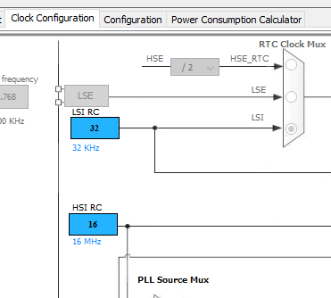

For our purposes however the internal clock source is not enough.
We want to use the external oscillator present in our board to get a more reliable and precise clock (mostly to send data without errors through a serial line). The internal clock is not so reliable, since it is composed just by a simple Resistor-Capacitor circuit.

To switch to the *external clock* source, let's go back to `Pinout` tab and choose `RCC` entry in left panel, then select the `High Speed Clock (HSE)` by changing its value from `Disable` to `BYPASS Clock Source`.

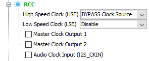

> **NOTICE**: The difference between the *high speed* clock and *low speed* one is just a matter of how fast you want to go. If your requirements don't need you to use the high speed clock you can stick with the low speed one for better power saving and lower consumptions. We'll stick with the high speed one however for simplicity.

Now let's go back to `Clock Configuration` again and select the correct values for the registers. Since the external source we have on our board (by the specifications) has a nominal frequency of 8 MHz, we will put this value in the `Input Frequency` block. Also, let's change the switch from `HSI` to `HSE`.

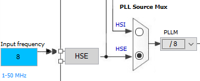

Also, select `PLLCLK` option in the switch at the right of the displayed one; this allows us to obtain a different clock frequency as a base for our final clocks (shown on the right-side of the scheme). The `PLLCLK` gives us many more configuration options than selecting only the `HSE` option (after which we can only set a prescaler).

Now let's look at the right side of the scheme and decide which values we want as resulting clocks. One of the clocks we are interested in is the `HCLK` one, which is used to communicate using the serial over USB cable.

> Clocks and timers within a Cortex processor are connected to various different clock sources, all delivered starting from the clock source provided on the left. These clock sources are:
> - `HCLK`: is the actual processor clock source and it drives SysTick timer.
> - `FCLK`: it is synchronized with HCLK, but it's not affected by sleeping condition of the processor, in which `HCLK` stops; `FCLK` ensures that interrupts can be sampled, and sleep events can be traced, while the processor is sleeping.
> - `APB1`/`APB2`: they stand for Advanced Peripheral Bus, on which there are the clock sources to which most peripherals and timers are connected. The relative clock sources are limited to a maximum of 54 and 108 MHz respectively when driving *peripheral clocks* and 108 and 216 MHz respectively when driving *timer clocks*. For a complete reference of which peripherals/clocks are connected to these two timers refer to the following table.


| Clock Source          | Maximum<br>Frequency<br>(default) | Timer/Peripheral                                                                                                                              |
| --------------------- | --------------------------------- | --------------------------------------------------------------------------------------------------------------------------------------------- |
| APB1 Peripheral Clock | 54 MHz                            | LPTIM1 WWDG SPI2/I2S2 SPI3/I2S3 SPDIFRX<br>USART2 USART3 UART4 UART5 UART7 UART8<br>I2C1 I2C2 I2C3 I2C4<br>CAN1 CAN2 CAN3<br>HDMI-CEC PWR DAC |
| APB1 Timer Clock      | 108 MHz                           | TIM2 TIM3 TIM4 TIM5 TIM6 TIM7 TIM12 TIM13 TIM14                                                                                               |
| APB1 Peripheral Clock | 108 MHz                           | USART1 USART6<br>ADC1 ADC2 ADC3<br>SDMMC1 SDMMC2<br>SPI1/I2S1 SPI4 SPI5 SPI6<br>SYSCFG SAI1 SAI2 DFSDM1<br>MDIO LTDC DSI                      |
| APB2 Timer Clock      | 216 MHz                           | TIM1 TIM8 TIM9 TIM10 TIM11                                                                                                                    |


Since we want the system clock to be as much high as possible, we will select 216 MHz in `HCLK` field; once that value is entered we can just let the program calculate the other values by itself. If we don't like final result we can modify them by hand later.

In particular, the program tells us when some configuration is in conflict with acceptable values from any component by flagging the wrong value as `red`. Adjust values until you get a suitable configuration (prescalers, `ABP1`, `ABP2`, and so on).
The following is a configuration which is compatible with previous requirements:


> **NOTICE**: when generating code from Cube, there could be a bug in which the program will set the wrong `OscillatorType` in `RCC` configuration contained in generated code. Check that the generated code contains the following line exactly:
> `RCC_OscInitStruct.OscillatorType = RCC_OSCILLATORTYPE_HSE;`

## USART Configuration

For our purposes, we will use the USART3 functionality to perform serial communication over USB. To configure this, select the `Pinout` tab, under the `USART3` voice in left panel set the mode to `Asynchronous`. Then let's assign PINs to `USART3`. Set `PD8` as `USART3_TX` and `PD9` as `USART3_RX`.


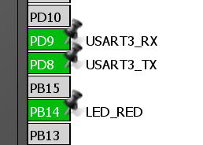

Next move to `Configuration` tab and click on `USART3` to configure the USART with the following settings:

| Parameter         | Value                             |
| ----------------- | --------------------------------- |
| Baud Rate         | 115200 Bits/s (automatically set) |
| Word Length       | 8 Bits (including parity)         |
| Parity            | None                              |
| Stop Bits         | 1                                 |
| Data Direction    | Receive and Transmit              |
| Over Sampling     | 16 samples                        |
| Single Sample     | Disable                           |
| Advanced features | All Disabled                      |

> **NOTICE**: For low speed ports it’s better to have 16 samples per transmit, but at higher speeds it won’t be possible to configure it like this, due to clock limitations.

> **NOTICE**: We selected this baud rate because it is compatible with the clock that is generated by our clock source. In fact, the maximum clock source to USART3 peripheral is 54 MHz (is it connected to APB1 peripheral clock) and for that particular baud rate the error percentage between desired rate and actual rate is about 0.05%, which is way less the 5% error required by USART to function properly.

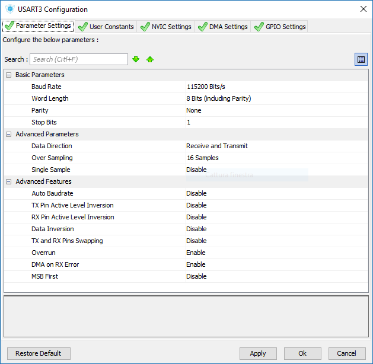

> The timeout for the transmit operation has to be big enough so that for each bit that has to be transmitted the program will wait for at least one cent of millisecond; considering that the transmit requires 10 bits per byte, the global wait time must be at least one tenth of millisecond per byte.

Once code is generated we can modify it (in the appropriate spaces) to send data through USART3 and we can read data using PuTTY on PC for example. 

Now if you have a serial emulator terminal like Putty you can read the transmitted value.

## Reading/Writing GPIO PINs

If we want to check wether the PINs we set work, we can modify generated code so that a LED will light up when we press the user button. To do so, let's go in `main` function and insert the following lines within the infinite loop:
``` c
if (HAL_GPIO_ReadPin(BTN_USR_GPIO_Port, BTN_USR_Pin))
{
    HAL_GPIO_WritePin(LED_BLUE_GPIO_Port, LED_BLUE_Pin, 1);
}
else
{
    HAL_GPIO_WritePin(LED_BLUE_GPIO_Port, LED_BLUE_Pin, 0);
}
```

Or in a more compact way:
``` c
HAL_GPIO_WritePin(LED_BLUE_GPIO_Port, LED_BLUE_Pin,
    HAL_GPIO_ReadPin(BTN_USR_GPIO_Port, BTN_USR_Pin));
```

## ~~Reading~~/Writing on USART using Blocking API

Since we haven't configured any interrupt/DMA mechanism yet, we can only send data on USART synchronously. To do so, the following code can be used (again, put it within infinite while loop):
```c
HAL_UART_Transmit(&huart3, "HelloWorld\r\n", 12, 4);
```
where:
- `&huart3` is the address of our USART handler;
- `"HelloWorld\n"` is the pointer to the message we want to send;
- `11` is the length of the message;
- `4` is the timeout, expressed in ~~milliseconds~~ **_???_**.

If we now start PuTTY on Windows and we select the correct port with the settings we put in our USART3 configuration we can read the values. The right port name can be found if we open `Device Manager` on Windows, under `Serial Ports (COM and LPT)`.

While this example used blocking API to transfer data, there are two ways to transfer them asynchronously, either using *Interrupts* or *DMA*.

> **NOTICE**: Remember that when transferring data between memory and peripherals, not only in asynchronous mode using either `IT` or `DMA` modes, but also for blocking API calls, the memory location that has been specified in the call shall remain untouched until the data transfer has been completed. This means that **no automatic variables can be used to transfer data from memory to peripherals**, because automatic variables live in stack space and thus their memory location is most likely overwritten
> - when the current function terminates and another function call is performed;
> - when an interrupt arrives and the current function execution is preemtped (this happens even when using blocking API calls).
> That's why only `static` variables or global variables should be used to send/receive data.

## Interrupts and USART3 Interrupt API

In the way we programmed until now, we cannot create parallel tasks (in a timed or in any way in general). To do so, in particular for time-activated tasks, we need to configure the interrupt environment. When enabled, a peripheral can be also controlled using interrupts, instead of setting a timeout to wait for the blocking operations to complete like we did before.

The first action that we need to do is to enable interrupts in Cube. In the `Configuration` tab, select `NVIC` (Nested Vector Interrupt Controller) entry to open interrupt handler configuration. From this window we can change priorities of interrupts and other configurations.

The highest priority in the ARM architecture is the 0-priority, while the lowest is 15 (if 4 bits of *preemption priority*, also called *sub-priority* are used). Higher priority interrupts can preempt only strictly lower priority interrupt handlers (this is true also if we enable also sub-priorities).

The sub-priority is used only if the processor has to choose between two or more same-priority interrupts in a given moment. Typically this happens whenever a high-priority interrupt ends its execution and the processor has to choose between more than one interrupt with same priority. This is the only case where sub priority has a meaning, and once again, lower absolute value means higher sub-priority.

> While usually the 0-priority is reserved to faults or other system interrupts, we can use it because their trigger is so unlikely that when it happens it's something so bad that our system could be irreversibly damaged, like when the processor encounters very big problems. However the good practice is to change the priority of peripheral handlers to a non-zero value.

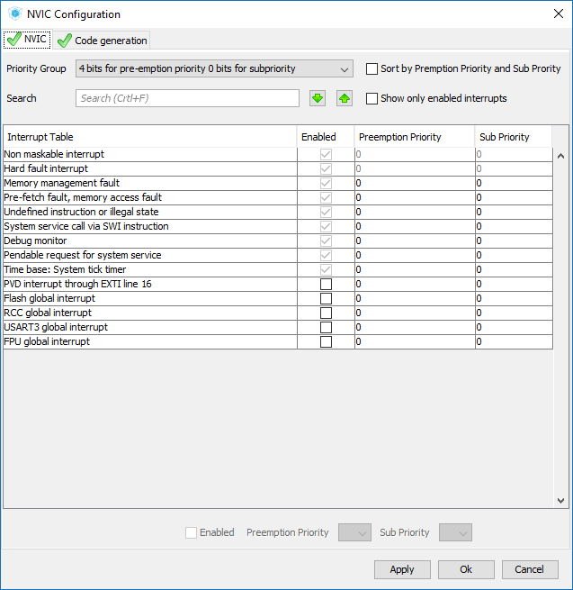

In alternative, each interrupt handler can be enabled/managed from the configuration window of the associated device. In our case the `USART3` controller. For the USART3 interrupt we will configure the lowest priority possible (without sub priorities) which is 15.

> **Notice**: if we have a system where tasks are activated at different rates using different timers, assigning to these timers different priorities will configure also a priority between their associated tasks.

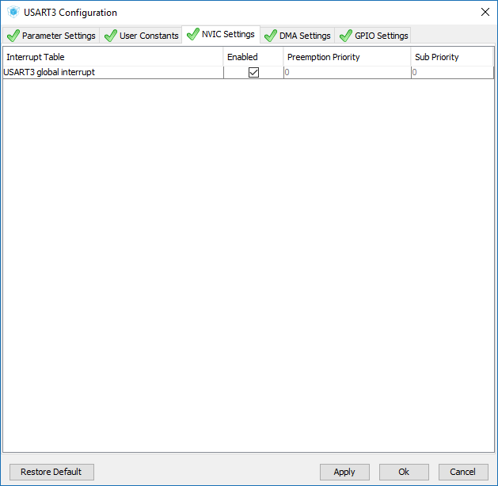

")

Now that we have configured the USART3 to use interrupts we can use its Interrupt API calls to send data asynchronously. We can even override `__weak` functions defined by Cube to react when transmission is finished/data is received. `__weak` functions defined by Cube do nothing.

Of course, since calls for transmitting are not blocking anymore we cannot use them within the infinite loop. We can however write the first transmit just before the infinite loop and then define the handler for when the transmit is completed, like this:
``` c
/* USER CODE BEGIN PV */
/* Private variables ---------------------------------------------------------*/
static char text[] = "HelloWorldIT\r\n";
/* USER CODE END PV */

/* ... */

/* USER CODE BEGIN 0 */
void HAL_UART_TxCpltCallback(UART_HandleTypeDef *huart)
{
    /* The callback is the same for any UART handler. */
    if(huart == &huart3)
    {
        /* Interrupt-based transmit has no timeout,
         * since it's not blocking.
         */
        HAL_UART_Transmit_IT(&huart3, (unsigned char*) text, strlen(text));
    }
}
/* USER CODE END 0 */

/* ... */

int main(void)
{
    /* ... */

    /* USER CODE BEGIN 2 */
    HAL_UART_Transmit_IT(&huart3, (unsigned char*) text, strlen(text));
    /* USER CODE END 2 */

    while(1)
    {
        /* ... */
    }
}
```
## Timers

Now we can execute code triggered by interrupts, however usually we want to execute code at fixed intervals of time, thus a timer is needed.

> **NOTICE**: It’s never a good idea to use the system timer inside the ARM processor (SysTick) to schedule tasks. Our systems will be developed on bare-metal microprocessors, but usually that timer is reserved to Operating Systems to do their stuff. If we'd like our code to be portable, we should design our modules using other timers. SysTick timer has a fixed 0-priority and cannot be changed.

The board we use includes two advanced-control timers, eight general-purpose timers, two basic timers and two watchdog timers. All timers have a 16-bit prescaler. The following table is based on the one included in the datasheet:

| Timer<br>Type        | Timer          | Clock Max<br>Frequency<br>(MHz) | Counter<br>Resolution | Counter<br>Type       | DMA<br>Request<br>Generation | Capture/<br>Compare<br>Channels |
| -------------------- | :------------: | :-----------------------------: | --------------------- | --------------------- | :--------------------------: | :-----------------------------: |
| Advanced-<br>Control | TIM1<br>TIM8   | 216                             | 16-bit                | Up<br>Down<br>Up/Down | Yes                          | 4                               |
| General<br>Purpose   | TIM2<br>TIM5   | 108                             | 32-bit                | Up<br>Down<br>Up/Down | Yes                          | 4                               |
| General<br>Purpose   | TIM3<br>TIM4   | 108                             | 16-bit                | Up<br>Down<br>Up/Down | Yes                          | 4                               |
| General<br>Purpose   | TIM9           | 216                             | 16-bit                | Up                    | No                           | 2                               |
| General<br>Purpose   | TIM10<br>TIM11 | 216                             | 16-bit                | Up                    | No                           | 1                               |
| General<br>Purpose   | TIM12          | 108                             | 16-bit                | Up                    | No                           | 2                               |
| General<br>Purpose   | TIM13<br>TIM14 | 108                             | 16-bit                | Up                    | No                           | 1                               |
| Basic                | TIM6<br>TIM7   | 108                             | 16-bit                | Up                    | Yes                          | 0                               |

### Configurable Timers Characteristics

#### Advanced-Control Timers (TIM1, TIM8)
The advanced-control timers (TIM1, TIM8) can be seen as three-phase PWM generators multiplexed on 6 channels. They have complementary PWM outputs with programmable inserted dead times. They can also be considered as complete general-purpose timers. Their 4 independent channels can be used for:
- Input capture
- Output compare
- PWM generation (edge- or center-aligned modes)
- One-pulse mode output

If configured as standard 16-bit timers, they have the same features as the general-purpose TIMx timers. If configured as 16-bit PWM generators, they have full modulation capability (0-100%).
They support independent DMA request generation. 


#### General-Purpose Timers (TIMx)
There are ten synchronizable general-purpose timers embedded in the STM32F76xxx devices.
- Full-featured general-purpose timers (TIM2, TIM3, TIM4, TIM5)
    - The TIM2 and TIM5 timers are based on a 32-bit auto-reload up/downcounter.
    - The TIM3 and TIM4 timers are based on a 16-bit auto-reload up/downcounter.
    - They all feature 4 independent channels for input capture/output compare, PWM or one-pulse mode output. This gives
up to 16 input capture/output compare/PWMs ~~on the largest packages~~.
    - They all have independent DMA request generation and they are capable of handling quadrature (incremental) encoder signals and the digital outputs from 1 to 4 hall-effect sensors.
- Limited general-purpose timers (TIM9, TIM10, TIM11, TIM12, TIM13, TIM14)
    - These timers are based on a 16-bit auto-reload upcounter.
    - TIM10, TIM11, TIM13, and TIM14 feature one independent channel, whereas TIM9 and TIM12 have two independent channels for input capture/output compare, PWM or one-pulse mode output. They can also be used as simple time bases.

#### Basic Timers (TIM6, TIM7)
These timers are mainly used for DAC trigger and waveform generation. They can also be used as a generic 16-bit time base.
TIM6 and TIM7 support independent DMA request generation.

### Timer Clock Sources
The timer always needs a clock source. It also can be synchronized by several clocks
simultaneously:
- Internal clock, clock is the default provided by RCC; its frequency depends wether the timer belongs to APB1 or APB2 buses.
- External clock, in this cases the clock is provided by an external signal connected to TIx pins or ETR pin. The maximum external clock frequency should be verified.

### Timer Modes for each Channel

Each timer which supports one or more channels supports different modes in which these channels can be used, each with a different purpose.

#### Timer Input Capture Mode

The timer can be used in input capture mode to measure an external signal. Depending on timer clock, prescaler and timer resolution, the maximum measured period is deduced.

The input capture module is used to capture the value of the counter after a transition is detected by the corresponding input channel. To get the external signal period, two consecutive captures are needed. The polarity index is 1 if the rising or falling edge is used, and 2 if both edges are used.

#### Timer Output Compare Mode

To control an output waveform, or to indicate when a period of time has elapsed, the value of the counter `CNT` is compared with respect to the content of a compare register `CRRy`, where `y` is the index of the channel.

Usually a signal can be set high when the value in `CNT` is either exactly equal to ~~, greater or lower than~~ the content of `CRRy`. 
When `CNT` reaches the value stored into `CCRy` a compare event is
generated and, on the basis of a configuration,
- the output is set
- the output is reset
- the output is toggled

#### Timer PWM Mode

The timer is able to generate PWM in edge-aligned mode or in center-aligned mode with a frequency determined by the value of the `TIMx_ARR` register, and a duty cycle determined by the value of the `TIMx_CCRy` register, where `y` is the associated channel.

> Duty cycle is expressed through `TIMx_ARR` and `TIMx_CRRy` content in time units.

There are two modes, the first one:
- PWM mode 1
    - In up-counting, channel`y` is *active* as long as `CNT < CCRy`, otherwise it is inactive.
    - In down-counting, channel`y` is *inactive* as long as `CNT > CCRy`, otherwise it is active.
- PWM mode 2
    - In up-counting, channel`y` is *inactive* as long as `CNT < CCRy`, otherwise it is active.
    - In down-counting, channel`y` is *active* as long as `CNT > CCRy`, otherwise it is inactive.


When we combine these modes with the different counting modes that we can select, we obtain the following scenarios (which are also resumed in the following table):
- if we adopt PWM mode 1 and `CNT` is reset to zero when `ARR` value is reached, then we get a *left/right-aligned PWM signal with duty cycle *, where alignment depends on the counting direction, respectively up/down.
- if we adopt PWM mode 1 and counting mode is inverted when `CNT` reaches `ARR` or zero value, then we get a *middle-aligned PWM signal with duty cycle *.
- if we adopt PWM mode 2 and `CNT` is reset to zero when `ARR` value is reached, then we get a *right/left-aligned PWM signal with duty cycle *, where alignment depends on the counting direction, respectively up/down.
- if we adopt PWM mode 2 and counting mode is inverted when `CNT` reaches `ARR` or zero value, then we get a *middle-aligned PWM signal with duty cycle *.

| PWM Mode | Counting Mode | Duty Cycle                                                                       | Alignment |
| :------: | ------------- | :------------------------------------------------------------------------------: | :-------: |
| 1        | Up            |      | left      |
| 1        | Down          |      | right     |
| 1        | Up/Down       |      | middle    |
| 2        | Up            |  | right     |
| 2        | Down          |  | left      |
| 2        | Up/Down       |  | middle    |

> **NOTICE**: I'm not 100% sure, but maybe duty cycle is actually based on the fraction , I should check in the future.

#### Timer One Pulse Mode

If needed, refer to [STM32 cross-series timer overview](https://www.st.com/content/ccc/resource/technical/document/application_note/54/0f/67/eb/47/34/45/40/DM00042534.pdf/files/DM00042534.pdf/jcr:content/translations/en.DM00042534.pdf) (also known as *Application Note AN4013*), section 2.6.

## Configuring a Timer using Cube

To enable a timer and set its mode for each required channel, select the timer you want to use in the left panel of `Pinout` tab. While TIM6 and TIM7 have no additional configuration for channels (since they have none), for other TIMx timers you can select for each channel the preferred mode.

> Slave Mode and other configuration options that we haven't covered in previous section can be ignored.

The following is an example of the basic mode configuration for TIM1.

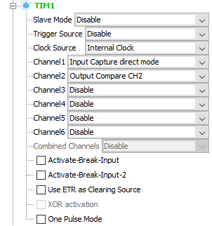

Once a timer and its relevant channels are enabled, we can move on to `Configuration` tab and select its entry under `Control` section.

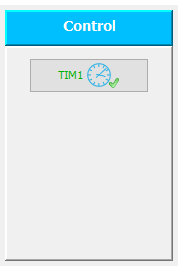

Once selected, the following window pops up:

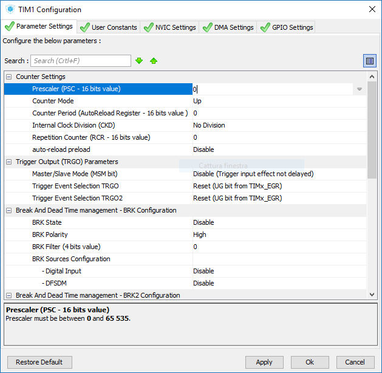

### Timer Counter Settings
Independently from the number of enabled channels we have for the current timer, we need to set up the behavior of its `CNT` registers, by managing which values shall be contained in its prescaler and other count management registers:
- *Prescaler*: this is an additional 16-bit counter that precedes the actual counter. The output of the prescaler changes only when a complete cycle is finished, thus we can change the rate at which the `CNT` register is changed with respect to the frequency of the clock source connected to the timer. The value of this field is the maximum value that can be reached. Basically, if we want to count 4000 clock cycles before incrementing/decrementing the value in `CNT` we need to put `3999` in this field.
- *Counter mode*: if the timer supports various counter modes, we can select the one we prefer, either
    - Up - when the maximum value is reached we start again from zero;
    - Down - starts from the maximum value and when zero value is reached start again from maximum;
    - Up/Down - also called *center-aligned*, start counting up, when maximum value is reached switch to down, switch again when zero is reached.
- *Counter Period*: contained in *Auto Reload Register* (`ARR`), it is actually expressed as the maximum value that can be reached counting up or from which counting starts when going down, thus the same reasoning that has been applied to the prescaler can be applied here.
- *Internal Clock Division* (`CKD`): it acts like the prescaler above, but can only be set usually to small values (no division, 2, 4). Basically the clock seen by the timer has a period that is either the same, double or four times the one of the input clock.
- *Repetition Counter* (`RCR`): if present, it can count how many times a full cycle of the `CNT` counter has been reached. If its maximum value is set to a value different than zero, the event generated by the timer will be generated only when `RCR` value has reached the maximum one.
- *Auto Reload Preload*: if enabled, it enables the counter to start again once the maximum/minimum value are reached when counting up/down. Otherwise the timer will count only once until the desired value is reached.

Using previous settings, we can set the frequency of an event generated by a counter in *Input Capture Mode* using the following formula:
<!--
    $ f_{event} = \frac{f_{TIMx\_CLK}}{CKD \cdot (PSC + 1) \cdot (ARR + 1) \cdot (RCR + 1)} $
-->

\cdot(ARR&plus;1)\cdot(RCR&plus;1)})

where:
- `f_event` is the frequency at which an event from the timer will be generated;
- `f_TIMx_CLK` is the frequency of the timer's input clock;
- `CKD` is the content of *Clock Division Register*;
- `PSC` is the content of *Prescaler Register*;
- `ARR` is the content of *Auto Reload Register*;
- `RCR` is the content of *Repetition Counter Register*.

These values are subject to the following limits:

| Register | Number of bits | Maximum Value (+1)      |
| -------- | :------------: | ----------------------- |
| `CKD`*   | -              | 1 - 2 - 4               |
| `PSC`    | 16             | 65.536                  |
| `ARR`    | 16<br>32       | 65.536<br>4.294.967.296 |
| `RCR`    | 16             | 65.536                  |
\* `CKD` register can only have one of the shown values.

> **NOTICE**: not all timers support `CKD` and `RCR` behaviors. If they are nor supported, consider `CKD` as 1 and `RCR` as 0.

#### Example: Calculating the Required Values

Timer TIM1 has an input clock frequency of 216 MHz. Suppose we want to use it to generate exactly (if possible) *one interrupt signal every second*.

Since 216 MHz are equal to 2.16e+8 Hz or 216.000.000 Hz, we need to divide the input clock frequency by 216.000.000 somehow.
Remember also the limits shown in the table before, where we need to consider `ARR` as a 16-bit register, since TIM1 is a 16-bit timer.

To do so, we can have multiple choices; probably one of the most simple alternatives is to make the `CNT` register to increment one time each tenth of a second, achievable setting:
```
CKD = 1
PSC = 21600 - 1 = 21599
ARR = 10000 - 1 = 9999
RCR = 1     - 1 = 0
``` 

Then we need to remember to set the counting direction to up and the *Auto Reload Preload* as enabled.

### Timer Interrupt Generation Settings
A timer can be used to generate interrupts when an event is reached within any of its channels. To do so, we need first to enable the interrupt generation for that timer from within Cube, and then we need to start the timer from our user code.

When inside a timer configuration window, select the `NVIC Settings` tab to enable the required interrupts.
There are many choices, and often some interrupt kinds are overlapped between more than one timer, as we can see from the following picture.

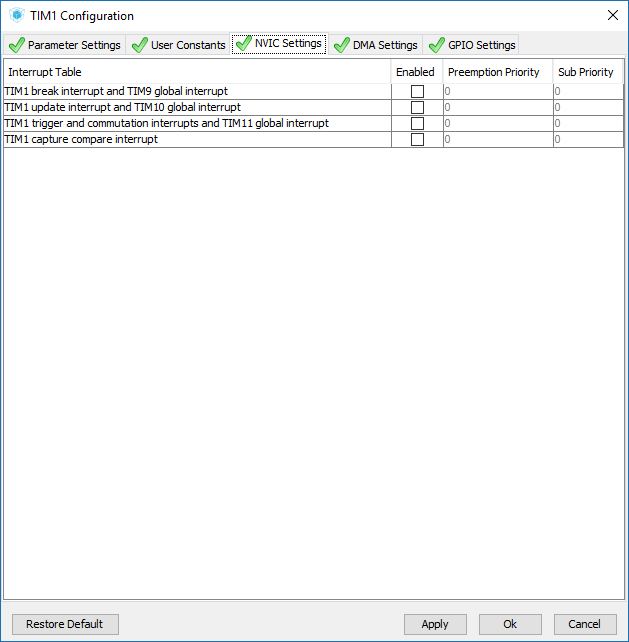

Usually we want to enable the entry `TIMx update interrupt`, even if it may overlap with other timers like in the figure. After enabling it, remember to go into `NVIC Configuration Window` and change its priority.

Of course, enabling only the capability of generating interrupts is not enough, we need to start the timer from our code if we want to use it.

To do so, we can use the following call:
``` c
HAL_TIM_Base_Start_IT(&htim1);
```

The same function without the `_IT` prefix can be used to start a timer, but it won't generate interrupts.

Once we start the timer in interrupt mode it will call an interrupt handler that we can define. The name of the handler depends on the interrupt we enabled and usually its location is within `stm32f7xx_it.c` file. In the case of the previous example it will be:
``` c
void TIM1_UP_TIM10_IRQHandler(void )
{
    /* USER CODE BEGIN TIM1_UP_TIM10_IRQn 0*/

    /* USER CODE END TIM1_UP_TIM10_IRQn 0*/

    HAL_TIM_IRQHandler(&htim1);
    
    /* USER CODE BEGIN TIM1_UP_TIM10_IRQn 1 */

    /* USER CODE END TIM1_UP_TIM10_IRQn 1 */
}
```

Our code of course will need to be within `BEGIN/END` pairs, or it will be overwritten. The call in the middle resets the interrupt line of the specified timer.

#### Example: Producing Periodic Data Using Interrupts

Suppose we want to produce periodically some data using a task and then send it as soon as possible over the serial communication. To do so, we need a mechanism that can be used to communicate between the periodic task (activated by a timer) and the infinite loop (which will send data on the serial line as soon as possible).

Since we don't like to have too much code within auto-generated files, let's create a file called `code.c` and its header file `code.h`, which will be used to access `code.c` functions from outside, since we'll call them either from main loop or from interrupt handlers.

Our `code.c` file will contain a few (private) shared variables and some public functions. The following is the complete file:

``` c
/* ----------------- INCLUDES ------------------ */

#include <string.h>
#include "stm32f7xx_hal.h"
#include "code.h"

/* -------------- EXTERN VARIABLES ------------- */

extern UART_HandleTypeDef huart3;


/* ------------- PRIVATE VARIABLES ------------- */

/* The shared buffer and its dimension */
#define BUFFER_LENGTH 1024

static const size_t buffer_len = BUFFER_LENGTH;
static uint8_t buffer[BUFFER_LENGTH];

#undef BUFFER_LENGTH

/* The pointer to the first data to be sent */
static uint32_t start = 0;

/* The pointer to the position next to the last
 * character to be sent
 */
static uint32_t stop = 0;


/* ------------- PUBLIC FUNCTIONS -------------- */

/* Function called within infinite loop to consume
 * data as soon as possible.
 */
void nrtcycle()
{
    uint32_t len = stop - start;

    /* If there is no data to be sent */
    if (len == 0)
        return;

    /* If there is data to be sent, let's check whether
     * the data can be sent all in one run or it shall be
     * sent in two transmits (i.e. data overflows from the
     * buffer and starts again from the beginning).
     */
    if (stop > start)
    {
        /* Data can be all sent in one transmit */
        HAL_UART_Transmit(&huart3, &buffer[start], len, len);
        start += len;
    }
    else
    {
        /* Data is split, let's send as much as we can
         * and then start over from the first position.
         */
        len = buffer_len - start;
        HAL_UART_Transmit(&huart3, &buffer[start], len, len);
        start = 0;
    }
}


/* Function called periodically to produce data. */
void intcycle()
{
    /* USER CODE BEGIN */
    static char my_data[] = "DCSM:XXX seconds elapsed\r\n";
    static uint8_t counter = 0;

    ++counter;

    sprintf(my_data, "DCSM:%03u seconds elapsed\r\n", counter);

    /* USER CODE END */

    /* NOTICE: We don't need to send the string
     * termination character.
     */
    bwrite((uint8_t*) my_data, strlen(my_data));
}

/* NOTICE: in this function we assume we never overrun
 * the buffer (overwrite old data yet to be sent).
 */
void bwrite(uint8_t data[], uint32_t len)
{
    uint32_t last = stop + len;
    uint32_t remaining = buffer_len - stop;

    /* Can we copy all data before reaching
     * the end of the buffer?
     */
    if (last < buffer_len)
    {
        /* We can copy all the data in one attempt */
        memcpy(&buffer[stop], data, len);
        stop = last;
    }
    else
    {
        /* We first copy as much as we can */
        memcpy(&buffer[stop], data, remaining);

        /* Then we copy the remaining data. */
        memcpy(&buffer[0], &data[remaining], len - remaining);

        /* New position is the remainder */
        stop = len - remaining;

        /* Or equivalently:
        stop = last % buffer_len;
        */
    }
}
```

Functions `nrtcycle` and `intcycle` (or optionally even `bwrite`) can be called from within other files. Thus, the following is the content of `code.h` header file:

``` c
#ifndef CODE_H
#define CODE_H

/* ----------------- INCLUDES ------------------ */

#include <stdlib.h>
#include <stdint.h>

/* ------------- PUBLIC FUNCTIONS -------------- */

/* Function called within infinite loop to consume
 * data as soon as possible.
 */
extern void nrtcycle();

/* Function called periodically to produce data. */
extern void intcycle();

/* NOTICE: in this function we assume we never overrun
 * the buffer (overwrite old data yet to be sent).
 */
extern void bwrite(uint8_t data[], uint32_t len);

#endif
```

> **NOTICE**: we cannot produce data for a dimension bigger than the buffer itself, we would probably go in buffer overflow condition wen we perform the second `memcpy` in the `else` block.

Of course, we can add more functions if we prefer to produce data from our `code.c` file. Usually we can put that code within `BEGIN/END` markers, but it is not a strict requirement this time.

#### Example: Sending Periodically Data to MATLAB

In previous example we sent each second a string formatted as `"DCSM:XXX seconds elapsed\r\n"`, where `XXX` is the print of the number of seconds elapsed (of course it starts again when 256 is reached). While we obviously can read this data from PuTTY or HTerm, we can receive it even from MATLAB. To do so we need to start Simulink and add a few blocks:
- *Serial Configuration* - configures all the parameters that are associated to a serial port.
- *Serial Receive* - configures parameters of the protocol used to exchange data over USART.
- *Serial Send* - it can be used to send formatted data through the same port.

If we just want to receive data from our previous example we can create the following model:

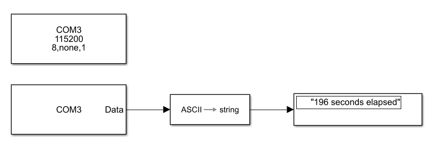

The Serial Configuration Block (on the top) is configured as it follows:

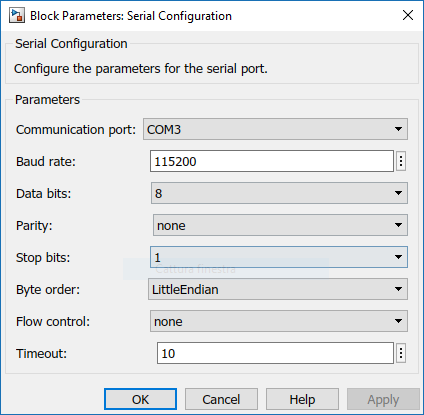

The Serial Receive Block (on the bottom) sends out data when both `Header` and `Terminator` configurations match (if set) and the data is the dimension specified in `Data size`. In our case, our strings have a fixed dimension of 19 characters between the header and the terminator. When no data is received or there is an error we can decide what to send outside, in this case we decided to send a `'\0'` ASCII value (`32`).

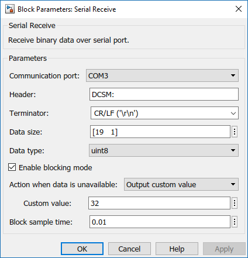

Now if we press `Run` we can read on the Display Block the data we received from the board.

#### Example: Generating Code from Simulink
As we already mentioned, data can be exchanged in both directions between the board and MATLAB. This can come in handy when we want to simulate a motor for example in MATLAB and control it using the board.

However often we don't want to send plain ASCII text between the board and MATLAB. To do so we need to define a data structure such that its definition is shared between the code that will run on the board and the Simulink model.

What we need is a Simulink Bus, which is the equivalent of a C data structure. When definied within Simulink, we can use the *code generation tool* to generate the data structure definition and even what the board will have to do, for example when trying to control a motor.

For this example, suppose we defined a Simulink model that represents the evolution over time of a physical projectile. Out initial Simulink model is the following:

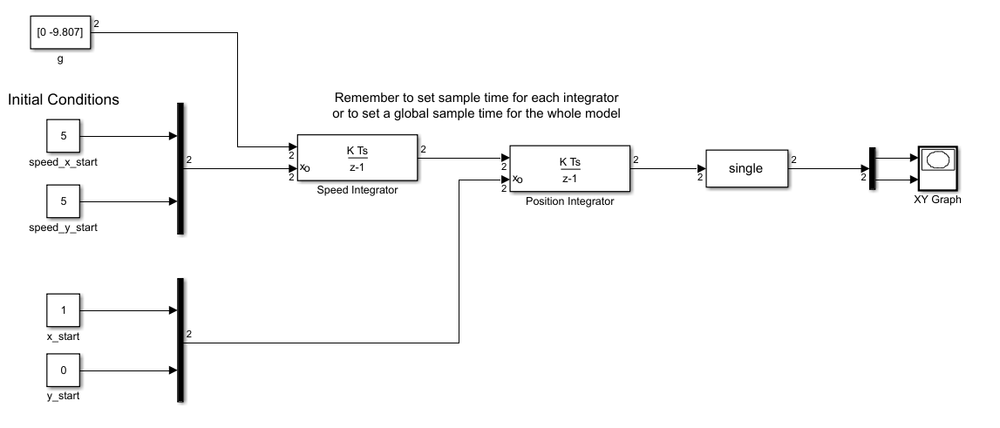

Let's first wrap it into a Subsystem, for which we can even use a mask to configure parameters, like this:
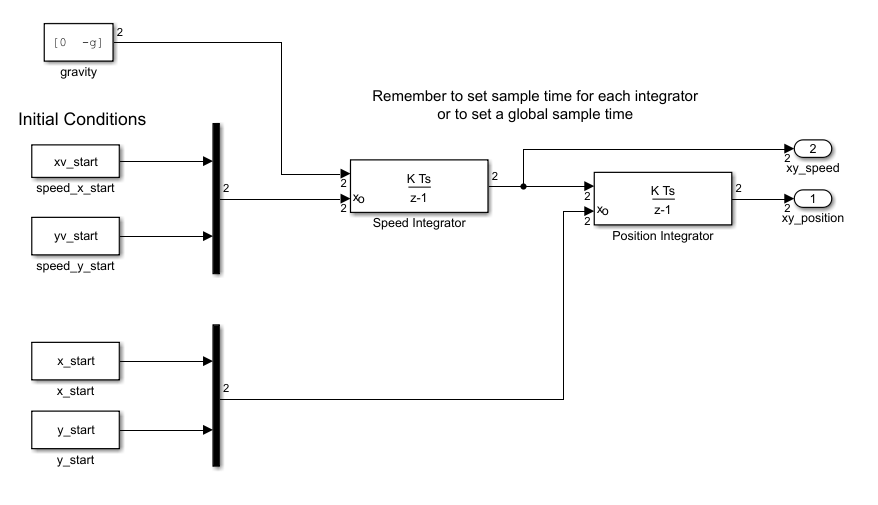
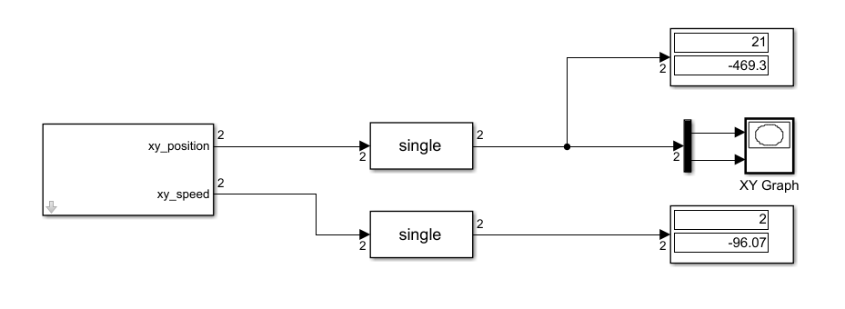
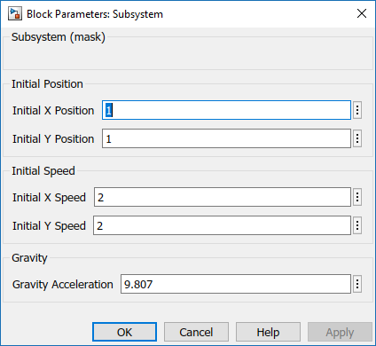

We are not done yet, to transfer data from the board to MATLAB we need to define a simulink bus (structure) and make sure that the model will write into that data structure.

To define a new Simulink bus open `Edit > Bus Editor` and then define it. To do so, create a new bus and then add more elements until you match how many data you want to transfer. Also, remember that for floating point data is highly recommended to use `single` precision, since `double` precision is not fully hardware supported in our boards **[is this true?]**.

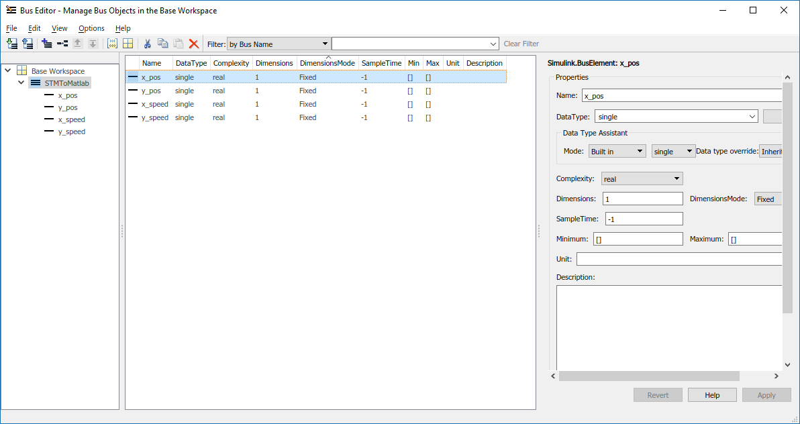

> **NOTICE**: Remember to export the bus to a `.m` file, because buses are not saved along with Simulink models, they must be manually loaded into MATLAB workspace.

Then let's include it in our model using *Data Store Memory*, *Data Store Read* and *Data Store Write* blocks. This way, our generated code will write into a global data structure its output values and we can read that data structure and send back data to Matlab. However, notice that for code generation a *Data Store Memory* block generates a *local* data store, which is not exported outiside the model (and thus cannot be accessed from outside the model when we generate code). To avoid this, we need to create a *global* data store programmatically:

``` sh
StmToMatlabData = Simulink.Signal;
StmToMatlabData.DataType   = 'Bus: StmToMatlab';
StmToMatlabData.Dimensions = 1;              # Dimensions and Complexity 
StmToMatlabData.Complexity = 'real';         # must be set explicitly
```

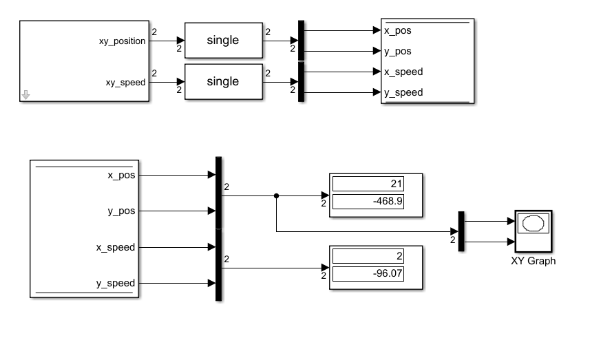

We now need to generate code. To do so we need to setup Code Generation Tool a little first. Go into `Configuration > Code Generation` and change the `System target file` to `ert.tlc`, which corresponds to the *Embedded Coder* System specification. Then select also `Generate Code Only`, since we'll have to compile the code using System Workbench.

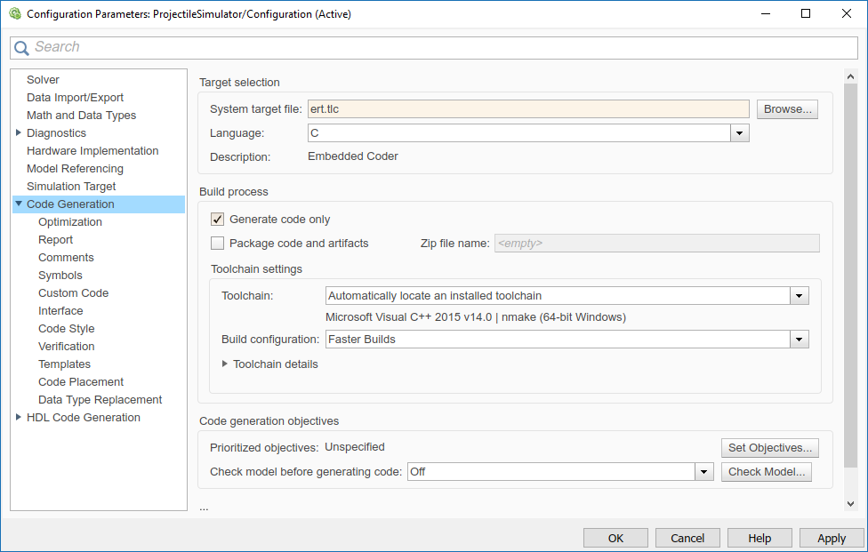

Before generating code, let's comment the blocks that won't run on the board (the ones on the receiving side of the Data Store). Otherwise we can just create a subsystem comprehending all the components that we want to use and generate code only for that subsystem.

To generate code we can then go under `Code` menu and select `Embedded Coder Quick Start`, with which we can select our architecture and other characteristics our generated code will have. Once code is generated we a new folder called `ModelName_ert_rtw` in which there are the following files (among the others):
- ModelName.c
- ModelName_data.c (optional?)
- ModelName.h
- rtwtypes.h

In our case, the name of the model was `ProjectileSimulator`.

Let's now proceed to add these files to our System Workbench project by drag-and-dropping them from the File Manager to System Workbench. We could even add them as hyperlinks, so that we don't need to copy them each time we re-generate code, however, I couldn't manage to make this work quickly (builds fail) thus I suggest you to copy files if needed.

Now we can use the functions and global variables defined in `ProjectileSimulator.h` from within our code.

> **NOTICE**: Also, remember to match the execution rate of `intcycle` function to the sample time required by Simulink by editing the information in Cude and re-generate code if needed. Double-check this, it's extremely important!

The code of our project shall be changed as it follows (assuming code is put within proper spaces in automatically-generated files from Cube):
- `main.c`

``` c
//...
#include "code.h"

int main()
{
    // ...

    init();
    HAL_TIM_Base_Start_IT(&htim1);

    // ...
    
    while(1) {
        nrtcycle();
    }
}
```

- `stm32f7xx_it.c`

``` c
// ...
#include "code.h"

void TIM1_UP_TIM10_IRQHandler(void)
{
  /* USER CODE BEGIN TIM1_UP_TIM10_IRQn 0 */
	intcycle();

  /* USER CODE END TIM1_UP_TIM10_IRQn 0 */
  HAL_TIM_IRQHandler(&htim1);
  /* USER CODE BEGIN TIM1_UP_TIM10_IRQn 1 */

  /* USER CODE END TIM1_UP_TIM10_IRQn 1 */
}
```

- `code.h`

``` c
#ifndef CODE_H
#define CODE_H

/* ----------------- INCLUDES ------------------ */

#include <stdlib.h>
#include <stdint.h>

/* ------------- PUBLIC FUNCTIONS -------------- */

/* Performs system initialization, if needed. */
extern void init();

/* Function called within infinite loop to consume
 * data as soon as possible.
 */
extern void nrtcycle();

/* Function called periodically to produce data. */
extern void intcycle();

/* NOTICE: in this function we assume we never overrun
 * the buffer (overwrite old data yet to be sent).
 */
extern void bwrite(uint8_t data[], uint32_t len);

#endif
```

- `code.c`

``` c
/* ----------------- INCLUDES ------------------ */

#include <string.h>
#include "stm32f7xx_hal.h"
#include "code.h"

#include "ProjectileSimulator.h"

/* -------------- EXTERN VARIABLES ------------- */

extern UART_HandleTypeDef huart3;


/* ------------- PRIVATE VARIABLES ------------- */

/* The shared buffer and its dimension */
#define BUFFER_LENGTH 1024

static const size_t buffer_len = BUFFER_LENGTH;
static uint8_t buffer[BUFFER_LENGTH];

#undef BUFFER_LENGTH

/* The pointer to the first data to be sent */
static uint32_t start = 0;

/* The pointer to the position next to the last
 * character to be sent
 */
static uint32_t stop = 0;


/* ------------- PUBLIC FUNCTIONS -------------- */

/* Performs system initialization, if needed. */
void init()
{
	ProjectileSimulator_initialize();
}

/* Function called within infinite loop to consume
 * data as soon as possible.
 */
void nrtcycle()
{
    uint32_t len = stop - start;

    /* If there is no data to be sent */
    if (len == 0)
        return;

    /* If there is data to be sent, let's check whether
     * the data can be sent all in one run or it shall be
     * sent in two transmits (i.e. data overflows from the
     * buffer and starts again from the beginning).
     */
    if (stop > start)
    {
        /* Data can be all sent in one transmit */
        HAL_UART_Transmit(&huart3, &buffer[start], len, len);
        start += len;
    }
    else
    {
        /* Data is split, let's send as much as we can
         * and then start over from the first position.
         */
        len = buffer_len - start;
        HAL_UART_Transmit(&huart3, &buffer[start], len, len);
        start = 0;
    }
}

typedef struct
{
	char header[4];
	int8_t body[sizeof(StmToMatlab)];

} usart_data;

/* Function called periodically to produce data. */
void intcycle()
{
    /* USER CODE BEGIN */

	// We initialize our structure to contain
	// the header "DCSM"
	static usart_data message = {
			.header = {'D', 'C', 'S', 'M'}
	};

	ProjectileSimulator_step();

    /* USER CODE END */
	// We copy the global data structure into our message body
	memcpy(&message.body, &StmToMatlabData, sizeof(StmToMatlab));

    /* NOTICE: We don't need to send the string
     * termination character.
     */
    bwrite((uint8_t*) &message, sizeof(usart_data));
}

/* NOTICE: in this function we assume we never overrun
 * the buffer (overwrite old data yet to be sent).
 */
void bwrite(uint8_t data[], uint32_t len)
{
    uint32_t last = stop + len;
    uint32_t remaining = buffer_len - stop;

    /* Can we copy all data before reaching
     * the end of the buffer?
     */
    if (last < buffer_len)
    {
        /* We can copy all the data in one attempt */
        memcpy(&buffer[stop], data, len);
        stop = last;
    }
    else
    {
        /* We first copy as much as we can */
        memcpy(&buffer[stop], data, remaining);

        /* Then we copy the remaining data. */
        memcpy(&buffer[0], &data[remaining], len - remaining);

        /* New position is the remainder */
        stop = len - remaining;

        /* Or equivalently:
        stop = last % buffer_len;
        */
    }
}
```

The final step is to receive data within Matlab. To do so, we'll merge both the serial receiver we used in the previous example and the plotting part of the `ProjectileSimulator` model. The resulting model is the following, where the *Byte Unpack* block has been used to convert data from an array of bytes to an array of `single`-precision values (but it can have any structured shape, since we can convert to a MATLAB cell-array data structure).

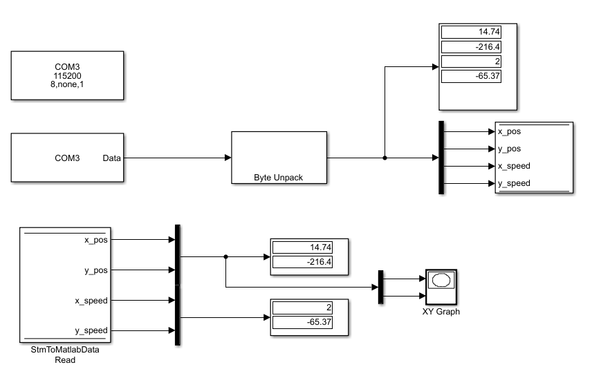


Follwing pictures show configuration of *Serial Receive* block and *Byte Unpack* block. The number of bytes of the message is due to the fact that single precision is implemented as `real32_T` in Simulink-generated code under our configuration.

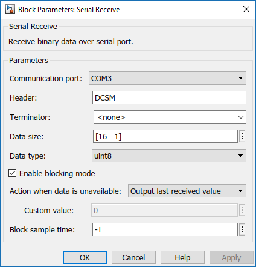
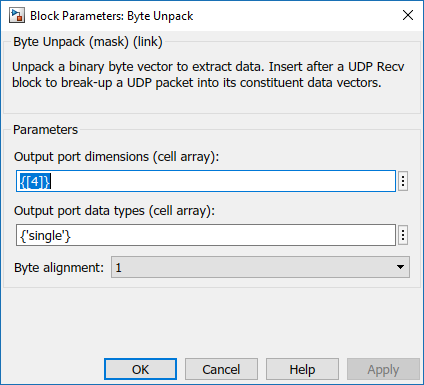

The sampling time is set to -1 because we set a global sampling time in Simulink model configuration. We didn't use variable step size.

The result is the following one:

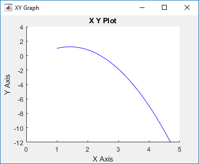

### Timer Output Compare Settings (TODO)

### Timer PWM Mode Settings (TODO)

## Using DMA

DMA is a way to transfer data from main memory to peripherals without involving the microprocessor. To do so, two *DMA Agents* are present on our board, each allowing us to program up to 8 different tasks.

We'll use DMA mainly to move data from main memory to USART and vice versa. To enable DMA for USART3 peripheral we need to enable a *DMA Request* from within Cube. To do so, we can configure it either from USART3 or DMA configuration windows, both inside `Configuration` tab.

Once one of these windows is opened we can add a new DMA Task clicking on `Add` and then configuring the type of request (between `USART3_TX` and `USART3_RX`), the memory stream to use, stream direction and so on, like in the following picture:

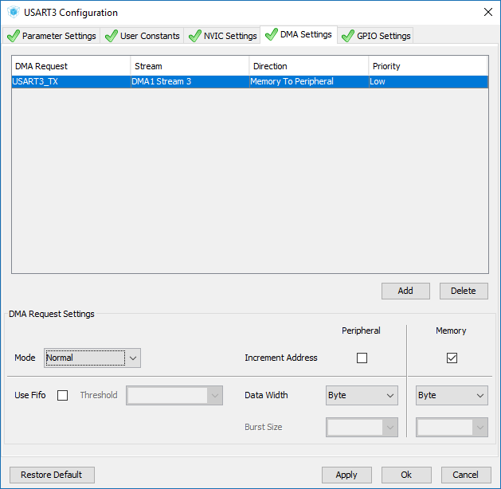

In the bottom of the window we can configure which `Mode` we want to use between `Normal` or `Circular` (when there is no data left, start again from the first), how much we want to increment when transfering data both in memory and in the peripheral address and the amount of data we want to transfer in each transaction.

When we transfer data to USART peripheral we can only transfer one byte at the time, because USART protocol allows only the exchange of one byte per message, however if we use a different peripheral chosing to transfer one entire word instead of a single byte can speed up greatly the DMA trasnfer.

> **NOTICE**: In certain architectures, DMA transfers do not even load the memory bus, because modern buses are no more simple lines connecting all the peripherals, but they are structured in a *matricial* form, so that most of the times data tranfers won't interfere with each other. For example, RAM is directly connected to the microcontroller, but many other lines can connect memory to other peripherals without interfering with the processor. That's why DMA is so important, we can remove some workload from the microprocessor and at the same time the bus will be less occupied to do these transactions, speeding up our program greatly.

Once we finished configuring DMA for USART3 we can generate once again code for our application and change all asynchronous data transfers from interrupt-based data transfers to DMA ones like the following example:
``` c
HAL_UART_Transmit_DMA(&huart3, &message, length*sizeof(char));
```
and that's it.

# Mechatronics Exam Package Practical Guide

While the basics of programming MATLAB/STM32 boards remain the same shown in this document, the package provided by the professor for the exam is slightly different in many ways:
- The Cube project has been already configured and requires only the code generation task (some paramters like timers may be configured to change execution rate, see later);
- No code for the board needs to be written by hand anymore: the professor wrote all the code that is not generated by Cube that interacts with the Simulink-generated code. The only thing that should to be changed (if needed) is the Simulink model name, the code will automatically adapt to the new name for Simulink calls (see later).
- Leds, buttons and other peripherals can be directly maneuvered from Simulink by reading/writing into Data Store Memories defined by the professor (that are updated/checked before/after the execution of Simulink step function by professor's C code).
- Simulink models containing already a few blocks for USART communication are provided. There is no need handle manually Simulink bus serialization/deserialization, it's already handled by a C library written by the professor and compiled into Matlab native code.

This simplifies of course many of the steps required to get the final result, once the basics of the package are clear.

## The Cube Project

We'll begin from the settings of the Cube project shipped within this package, so that if there is something not working it can be re-created by hand.

The configuration that I'll list here is the configuration that I was able to replicate on a new Cube project with a newer firmware version, since I was unable to work with professor's package.

Any other device has been left untouched, thus some configurations may have been skipped, for example `ADCx` ones. Some pins must be manually assigned, since default assignments uses different pins.
Configuration:

| Device | Configuration                                                                                                                                                                                                                                                                                                                                                                                                                                                                                                                                                                                                                                                                                                                                                                                             |
| ------ | --------------------------------------------------------------------------------------------------------------------------------------------------------------------------------------------------------------------------------------------------------------------------------------------------------------------------------------------------------------------------------------------------------------------------------------------------------------------------------------------------------------------------------------------------------------------------------------------------------------------------------------------------------------------------------------------------------------------------------------------------------------------------------------------------------- |
| I2C2   | I2C: `I2C`<br>**GPIO Labels**:<br>PF0 `IMU_SDA`<br>PF1 `IMU_SCL`                                                                                                                                                                                                                                                                                                                                                                                                                                                                                                                                                                                                                                                                                                                                          |
| RCC    | High Speed Clock: `BYPASS CLOCK SOURCE`<br>See [this section](#global-clock-configuration) for clock configuration.                                                                                                                                                                                                                                                                                                                                                                                                                                                                                                                                                                                                                                                                                       |
| SYS    | Untouched<br>(optionally, change Debug from `Disable` to `Serial Wire`)                                                                                                                                                                                                                                                                                                                                                                                                                                                                                                                                                                                                                                                                                                                                   |
| TIM1   | Clock Source: `Internal Clock`<br>Channel 1: `PWM Generation CH1`<br>Channel 2: `PWM Generation CH2`<br>Channel 3: `PWM Generation CH3`<br>**GPIO Labels**:<br>PE9 `TIM1_CH1_M1_PWM`<br>PE11 `TIM1_CH2_M2_PWM`<br>PE13 `TIM1_CH3_M3_PWM`<br>**Configuration**:<br>Prescaler: 0<br>Mode: up<br>Period: 10000<br>CKD: no<br>RCR: 0<br>Auto-reload preload: Disable<br>*NOTICE:* PWM pulse will be configured programmatically from Simulink, hence leave untouched in Cube.                                                                                                                                                                                                                                                                                                                                 |
| TIM3   | Combined Channels: `Encoder Mode`<br>**GPIO Labels**:<br>PB4 `TIM3_CH1_ENC1A`<br>PB5 `TIM3_CH2_ENC1B`<br>**Configuration**:<br>Prescaler: 0<br>Mode: up<br>Period: 65535<br>CKD: no<br>Auto-reload preload: Disable<br>Encoder Mode: Encoder Mode TI1 and TI2<br>                                                                                                                                                                                                                                                                                                                                                                                                                                                                                                                                         |
| TIM4   | Combined Channels: `Encoder Mode`<br>**GPIO Labels**:<br>PB6 `TIM4_CH1_ENC2A`<br>PB7 `TIM4_CH2_ENC2B_LED_BLUE`~~<br>**Configuration**:<br>Prescaler: 0<br>Mode: up<br>Period: 65535<br>CKD: no<br>Auto-reload preload: Disable<br>Encoder Mode: Encoder Mode TI1 and TI2<br>                                                                                                                                                                                                                                                                                                                                                                                                                                                                                                                              |
| TIM6   | Activated: `on`<br>**Configuration**:<br>Prescaler: 9<br>Mode: up<br>Period: 21599<br>Auto-reload preload: Disable<br>**NVIC**:<br>Enabled with preemption priority 15 and sub priority 0<br>                                                                                                                                                                                                                                                                                                                                                                                                                                                                                                                                                                                                             |
| TIM7   | Activated: `on`<br>**Configuration**:<br>Prescaler: 99<br>Mode: up<br>Period: 21599<br>Auto-reload preload: Disable<br>**NVIC**:<br>Enabled with preemption priority 14 and sub priority 0<br>                                                                                                                                                                                                                                                                                                                                                                                                                                                                                                                                                                                                            |
| TIM8   | Combined Channels: `Encoder Mode`<br>**GPIO Labels**:<br>PC6 `TIM8_CH1_ENC3A`<br>PC7 `TIM8_CH2_ENC3B`<br>**Configuration**:<br>Prescaler: 0<br>Mode: up<br>Period: 65535<br>CKD: no<br>Auto-reload preload: Disable<br>Encoder Mode: Encoder Mode TI1 and TI2<br>                                                                                                                                                                                                                                                                                                                                                                                                                                                                                                                                         |
| TIM10  | Activated: `on`<br>Channel 1: `PWM Generation CH1`<br>**GPIO Labels**:<br>PB8 `BUZZER_PWM`<br>**Configuration**:<br>Prescaler: 0<br>Mode: up<br>Period: 4095<br>CKD: no<br>Auto-reload preload: Disable<br>                                                                                                                                                                                                                                                                                                                                                                                                                                                                                                                                                                                       |
| USART3 | Mode: `Asynchronous`<br>**GPIO Labels**<br>PD9 `USART3_RX_VCP_USB`<br>PD8 `USART3_TX_VCP_USB`<br>**Configuration**:<br>Baud Rate: 230400 bps<br>Word Lenght: 8 bits<br>Parity: None<br>Stop bits: 1<br>**DMA**:<br>USART3_RX - DMA1 Stream1 - Peripheral to Memory - Low - Mode: Circular - Increment Address: Memory - Data Width: Byte<br>USART3_TX - DMA1 Stream3 - Memory to Peripheral - Low - Mode: Normal - Increment Address: Memory - Data Width: Byte<br>**NVIC**:<br>USART3 Global Interrupt - Enabled: on - Priority 3 - Sub priority 0<br>DMA 1 Stream 1 Global Interrupt - Enabled: on - Priority 1 - Sub priority 0<br>DMA 1 Stream 3 Global Interrupt - Enabled: on - Priority 0 - Sub priority 0                                                                                         |
| GPIO   | PB0 GPIO_Output `LED_GREEN`<br>PB7 TIM4Channel2 `TIM4_CH2_ENC2B_LED_BLUE`<br>PB14 GPIO_Output `LED_RED`<br>PC13 GPIO_Input `USER_BUTTON`<br><br>PD13 GPIO_Output `DIG_OUT0`<br>PD12 GPIO_Output `DIG_OUT1`<br>PD11 GPIO_Output `DIG_OUT2`<br>PE7 GPIO_Output `DIG_OUT3`<br>PD14 GPIO_Output `DIG_OUT4`<br>PD15 GPIO_Output `DIG_OUT5`<br><br>PF6 GPIO_Input `DIG_IN0`<br>PF7 GPIO_Input `DIG_IN1`<br>PF8 GPIO_Input `DIG_IN2` - pull-up<br>PF9 GPIO_Input `DIG_IN3` - pull-up<br>PF10 GPIO_Input `DIG_IN4` - pull-up<br>PF4 GPIO_Input `DIG_IN5` - pull-up<br><br>PF13 GPIO_Output `ENA_M1`<br>PF14 GPIO_Output `ENA_M2`<br>PF15 GPIO_Output `ENA_M3`<br><br>PG2 GPIO_Output `INA_M1`<br>PG4 GPIO_Output `INA_M2`<br>PG10 GPIO_Output `INA_M3`<br><br>PG3 GPIO_Output `INB_M1`<br>PG5 GPIO_Output `INB_M2`<br>PG12 GPIO_Output `INB_M3`<br> |
| ADC3   | Enable following ones:<br>IN0<br>IN9<br>IN12<br>IN13<br>**GPIO Labels**:<br>PA0/WKUP `PS_monitor`<br>PC2 `ADC3_IN12_CS_M2 `<br>PC3 `ADC3_IN13_CS_M3 `<br>PF3 `ADC3_IN9_CS_M1`<br>**Configuration**:<br>Clock Prescaler: PCLK2 Divided by 8<br>Scan Conversion Mode: Enabled<br>Continuous Conversion Mode: Enabled<br>Number of conversion: 4<br>**DMA**:<br>ADC3 - DMA2 Stream1 - Peripheral to Memory - Low - Mode: Circular - Increment Address: Memory - Data Width: Half Word (in both fields)<br>**NVIC**:<br>DMA2 Stream1 Global Interrupt - Enabled: on - Priority 1 - Sub Priority: 0                                                                                                                                                                                                                |

**MISSING LIST**:
- Encoders 1-2-3 external interrupt pins (used to reset encoder value based on `R` input).


## The C Code

We'll now move on to the C code that will be executed on the board along with the Cube-generated and the Simulink-generated ones.

[...]

Il prof:

In stm32f7xx_it.c:
- Ha usato il TIM6 per eseguire simulation_step()
- Ha usato il TIM7 per eseguire simulation_send()

In main.c:
- Ha eseguito simulation_init() solo prima del while

In simulink.c:
- Definisce il nome del modello in cima
- Nella init avvia i timer 6 e 7, inoltre avvia la ricezione dati su usart in DMA e l'ADC in DMA
- Nella send copia l'ultimo dato in una porzione di memoria accessibile da DMA e avvia la trasmissione
- Nella recv controlla l'header della roba ricevuta e se è valido copia la struttura dati
- Nella step
 -- copia tutti i valori possibili da GPIO, cazzi e mazzi dentro una struttura dati
 -- chiama la recv per aggiornare eventuali dati
 -- esegue la step del modello
 -- scrive tutto quello che è richiesto nei GPIO (gestito tutto da Simulink)

